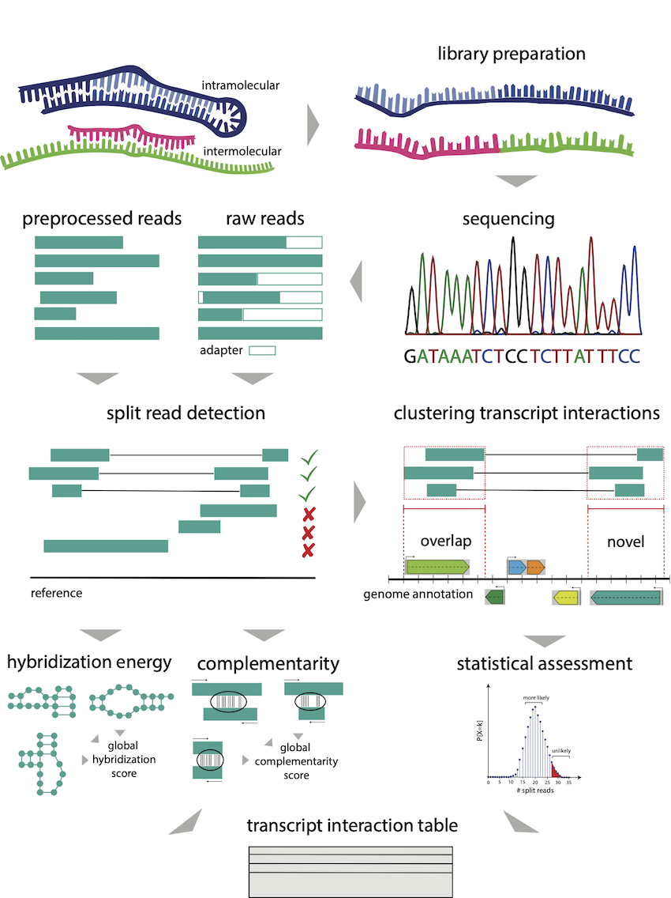

# RNAnue - 0.2.0

## About
RNAnue is a comprehensive analysis to detect RNA-RNA interactions from Direct-Duplex-Detection (DDD) data.

## Install
### Dependencies
RNAnue has the following dependencies, whereas the brackets indicate the version RNAnue has 
been build and tested on. Make sure the requirements are satified by your system. cmake is able
to detect the Boost libraries system-wide. However seqan is expected to be located in the current 
folder of RNAnue as specified in the CMakeLists.txt. Segemehl and the Vienna binaries need to be
located in $PATH.

* [Boost C++ Libraries](https://www.boost.org/) (v1.7.2)
* [SeqAn](https://github.com/seqan/seqan3) (v3.3.0)
* [Segemehl](http://www.bioinf.uni-leipzig.de/Software/segemehl/) (v0.3.4)
* [Vienna Package](https://www.tbi.univie.ac.at/RNA/#binary_packages) (v2.4.17)


### CMake
RNAnue is build using CMake. At first, clone the repository and change into the source directory.
```
git clone https://github.com/Ibvt/RNAnue.git
cd RNAnue 
```
In the next step, retrieve the SeqAn library and place it in the root folder of RNAnue
```

```


CMake is a cross-platform Makefile generator. For that, we provide the [CMakeLists](./source/CMakeLists.txt) 
to simplify the build process. In particular, it utilizes the instructions given in the CMakeLists.
It is recommended to create a "out-of-source build". For that, create a build folder (e.g., ./bin)
and cmake into the root directory.
```
cmake ../source/
```
This is be sufficient if the dependencies are located in $PATH. Calling `make` builds RNAnue. 

## Overview



## Usage

### Positional Arguments
RNAnue provides different functional arguments (subcalls) for individual procedures. These include `RNAnue preproc`, 
`RNAnue align`, `RNAnue clustering`, `RNAnue analysis`. In additon, `RNAnue complete` applies the whole workflow.

## Input
RNAnue requires the sequencing files to be in a specific folder structure. The root folders of the 
treatments (--trtms) and controls (--ctrls) are specified accordingly. These folders contain subfolders
with arbitrary conditions (e.g., treatment, cell lines,...) that in turn contain the read files, e.g.,

```
./trtms/
    condition1 
    condition2
./ctrls
    condition1
    condition2
```
It is to be noted that the `--trtms` needs to be specified. However, `--ctrls` may be not set (optional).

## Parameters
RNAnue accepts parameter settings both from the commandline and through a configuration file.
For the latter, we provide a template configuration file ([params.cfg](./build/params.cfg)) that
allows to set the parameters in a more convenient fashion. This means that the call of RNAnue 
is reduced to the following call. 
```
RNAnue <subcall> --config /path/to/params.cfg
```
Here, subcall corresponds to positional arguments.In any case, the specifying parameters over the command lines has 
precedence over the config file.


## Results

In principle, the results of the analysis are stored in the specified output folder and its subfolders
(e.g., ./preproc, ./align, ./clustering, ./analysis). RNAnue reports the split reads in SAM format, the clusters
and the RNA-RNA interactions. RNAnue reports the split reads in SAM format. Additionally, the complementarity 
scores and hybridization energies are stored in the tags FC and FE, respectively. We report the clusters in a
custom format that includes the IDs of the clusters, its length, size and genomic coordinates.

### Split Reads (.SAM)

RNAnue reports the detected splits in .SAM format (RNAnue `detect`). In this file, pairs of rows represent the
split reads, consisting of the individual segments, e.g
```
A00551:29:H73LYDSXX:1:1101:7274:10645	16	gi|170079663|ref|NC_010473.1|	3520484	22	1X51=	*	0	0	AGGGGTCTTTCCGTCTTGCCGCGGGTACACTGCATCTTCACAGCGAGTTCAA	*	XA:Z:TTTCTGG	XC:f:0.714286	XE:f:-15.6	XL:i:7	XM:i:5	XN:i:0	XR:f:0.0735294	XS:i:5	XX:i:1	XY:i:52
A00551:29:H73LYDSXX:1:1101:7274:10645	16	gi|170079663|ref|NC_010473.1|	3520662	22	11=5S	*	0	0	TTCGATCAAGAAGAAC	*	XA:Z:GAAGAAC	XC:f:0.714286	XE:f:-15.6	XL:i:7	XM:i:5	XN:i:0	XR:f:0.0735294	XS:i:5	XX:i:53	XY:i:68

```
In the following the tags are listed that are reported in the detected split reads. Please note that in the upper 
segment the alignment is in reverse as done in the calculation of the complemtarity to represent the 3'-5' and 5'-3' 
duplex.

| tag | description |
| --- | ----------- |
| XC:f | complementarity |
| XL:f | length of alignment |
| XR:f | site length ratio |
| XM:i | matches in alignment |
| XA:Z | alignment of sequence | 
| XE:f | hybridization energy |

### Clustering results


### Interaction table


### Docker
In additon, we provide a ready-to-use Docker container that has RNAnue preconfigured.
https://hub.docker.com/repository/docker/cobirna/rnanue

### Testing

# Troubleshooting
contact cobi@ibvt.uni-stuttgart.de or create an issue
